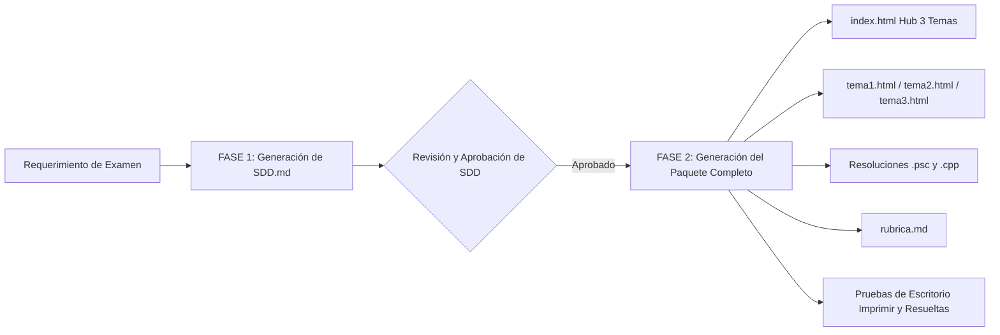

# ⚙️ SKILL: Generador de Exámenes SDD de 3 Temas (AyP - Módulo 2)

Este skill define la metodología **Spec-Driven Development (SDD)**, directivas pedagógicas, normas psicométricas de paridad cognitiva y arquitectura de software para la generación estandarizada de **paquetes de exámenes** de la cátedra de **Algoritmos y Programación (Módulo 2)**.

Cada examen se estructura invariablemente en torno a **3 temas equivalentes (Tema 1, Tema 2 y Tema 3)**.

---

## 🎯 Filosofía: Spec-Driven Development (SDD)

> **REGLA DE ORO:** Nunca se genera código (PSeInt/C++) ni maquetado web (HTML/Tailwind) sin haber generado, validado y aprobado previamente el archivo de especificación `SDD.md` en la carpeta destino del examen.

El flujo de trabajo consta de **dos fases secuenciales**:



---

## 📋 Estructura Pedagógica del Módulo 2 (Criterios y Ponderaciones)

Cada tema evalúa exactamente los mismos 5 bloques curriculares, sumando **100% de la calificación**:

| Bloque | Ponderación | Contenido y Objetivos Evaluados |
| :--- | :---: | :--- |
| **1. Menú y Estructura Principal** | **5%** | Ciclo repetitivo con menú modular, estructura condicional múltiple (`Segun` en PSeInt / `switch` en C++), pasaje de parámetros adecuado (por referencia para variables modificadas, por valor para lecturas). |
| **2. Entrada y Validación** | **15%** | Bucle de repetición (`Repetir...Hasta Que` o `do-while`) para validar rangos numéricos $[A, B]$ de forma estricta. Mensaje de error explícito ante valores fuera de rango. |
| **3. Proceso 1: Ciclos y Acumuladores** | **25%** | Ciclo condicional indeterminado (`Mientras` o `Repetir`), corte por centinela (ej. `0` o `-1`) o por umbral de agotamiento. Acumuladores, contadores, cálculo porcentual sobre meta/capacidad, y clasificación condicional de estado (ej. Óptimo / Aceptable / Crítico). |
| **4. Proceso 2: Búsqueda de Extremos** | **30%** | Ciclo determinado (`Para` / `for`) iterando sobre la cantidad ingresada en el Módulo de Entrada. Cálculo de ratio o métrica individual. Algoritmo de extremo (**MÁXIMO o MÍNIMO**) reteniendo obligatoriamente el **valor extremo y el identificador asociado** (nro de posición, nombre o identificador). |
| **5. Prueba de Escritorio (Papel y Lápiz)** | **25%** | Seguimiento manual paso a paso de un algoritmo de 12-18 líneas que ejercita bucles condicionales, acumuladores y banderas. Tabla de traza de variables, determinación de condición exacta de corte y salida final por pantalla. |

---

## 🚀 FASE 1: Generación del Documento `SDD.md`

Cuando el usuario solicita crear un nuevo examen o simulacro, el agente debe generar primero `SDD.md` en el subdirectorio correspondiente (ej: `Examenes/3er-examen/SDD.md`).

### Contenido Obligatorio del `SDD.md`:

1. **Metadatos Generales**:
   - Nombre de la instancia (ej. 2do Examen Parcial, 2do Simulacro, Recuperatorio Extraordinario).
   - Fecha y duración sugerida (120-150 minutos).
   - Cátedra: Algoritmos y Programación - Módulo 2 (Ingeniería en Informática).
   - Lenguajes soportados: PSeInt y C++.

2. **Universo Narrativo Común**:
   - Contexto temático cohesivo para los 3 temas (ej: Escuderías de Competición, Empresas Industriales Argentinas [YPF, Quilmes, La Serenísima], Logística Satelital, Centros de Datos y Servidores, Energías Renovables).

3. **Especificación Detallada de los 3 Temas (Tema 1, Tema 2, Tema 3)**:
   Para cada tema ($k \in \{1, 2, 3\}$):
   - **Nombre de fantasía y contexto narrativo**.
   - **Variables de entrada y rangos de validación** (ej. $1 \le \text{elementos} \le 15$).
   - **Proceso 1**: Condición de corte (centinela o umbral), acumulador, fórmula matemática de porcentaje o promedio, umbrales de categorización.
   - **Proceso 2**: Métrica unitaria evaluada en el ciclo `Para`, tipo de extremo buscado (MÁXIMO o MÍNIMO), identificador retenido.
   - **Prueba de Escritorio**: Algoritmo exacto en pseudocódigo, variables de la tabla, tabla de trazado paso a paso con valores por iteración, cantidad exacta de iteraciones, condición lógica de salida y mensaje impreso por pantalla.

4. **Matriz de Paridad Psicométrica y Cognitiva**:
   - Comprobación explícita de que **Tema 1, Tema 2 y Tema 3** tienen:
     - Idéntica complejidad ciclomática.
     - Misma cantidad de variables y pasaje de parámetros.
     - Misma cantidad de iteraciones en la prueba de escritorio (ej: exactamente 4 o 5 iteraciones).
     - Fórmulas de dificultad aritmética equivalente (sin operaciones asimétricas).

5. **Casos de Prueba Formales (3 casos por tema = 9 casos en total)**:
   - **Caso 1: Límites y Error en Entrada**: Entrada fuera de rango, mensaje de error, reingreso válido, salida inmediata o visualización de estado.
   - **Caso 2: Flujo Completo Normal**: Ejecución de las opciones 1, 2, 3 y 4 con valores típicos y resultados esperados.
   - **Caso 3: Valores Frontera / Límite**: Comportamiento con valores mínimos/máximos del rango o corte inmediato de acumulación.
   - *Formato de cada caso:*
     - Bloque `Entrada (Simulada)`: lista exacta de valores ingresados separados por salto de línea.
     - Bloque `Salida Esperada por Pantalla`: transcripción textual idéntica a la salida de consola.

---

## 📦 FASE 2: Generación del Paquete Completo de Examen

Una vez que el archivo `SDD.md` está aprobado, se generan los siguientes **10 archivos estandarizados**:

```
Examenes/<nombre-carpeta>/
├── SDD.md                              # Especificación técnica base (Fase 1)
├── index.html                          # Hub principal con selector interactivo de los 3 temas
├── tema1.html                          # Enunciado interactivo Tema 1
├── tema2.html                          # Enunciado interactivo Tema 2
├── tema3.html                          # Enunciado interactivo Tema 3
├── resolucion-tema1.psc                # Código solución PSeInt Tema 1
├── resolucion-tema1.cpp                # Código solución C++ Tema 1
├── resolucion-tema2.psc                # Código solución PSeInt Tema 2
├── resolucion-tema2.cpp                # Código solución C++ Tema 2
├── resolucion-tema3.psc                # Código solución PSeInt Tema 3
├── resolucion-tema3.cpp                # Código solución C++ Tema 3
├── rubrica.md                          # Rúbrica de evaluación docente
├── prueba_escritorio_imprimir.html     # Hojas de examen para imprimir (CSS print)
└── prueba_escritorio_resuelto.html     # Solucionario de prueba de escritorio para el docente
```

---

## 🎨 Especificaciones de Diseño y UX para los Archivos HTML

### 1. `index.html` (Hub Principal de 3 Temas)
- **Tecnología:** Tailwind CSS vía CDN (`https://cdn.tailwindcss.com`).
- **Fuentes:** Google Fonts `Inter` + `Anton` (para títulos destacados).
- **Layout:** Grid responsivo de 3 columnas (`grid grid-cols-1 md:grid-cols-3 gap-6`).
- **Cards de Temas:**
  - Fondo `bg-.../60 hover:bg-.../70 backdrop-blur-sm`, bordes sutiles, sombras dinámicas con hover scale (`transition-all duration-300 hover:scale-105`).
  - Emoji o icono temático de gran tamaño (`text-5xl mb-4`).
  - Badge de tema ("Tema 1", "Tema 2", "Tema 3").
  - Título y subtítulo conceptual.
  - Resumen pedagógico del tema.
  - Botón "Ver Enunciado" con flecha animada en hover.

### 2. `tema1.html`, `tema2.html`, `tema3.html` (Enunciados de Examen)
- **Estructura fija:**
  1. **Header:** Título con icono, subtítulo del tema, badge identificador.
  2. **Sección Contexto:** Narrativa inmersiva del problema.
  3. **Sección Tu Misión:** Lista de requerimientos técnicos con badges flotantes de porcentaje (5%, 15%, 25%, 30%) que despliegan tooltips interactivos con los criterios de la rúbrica al pasar el cursor.
  4. **Sección Casos de Prueba (Ejecuciones Esperadas):**
     - Botonera de tabs (`Caso 1`, `Caso 2`, `Caso 3`).
     - Split visual en dos columnas:
       - Columna izquierda: `Entrada (Simulada)` en contenedor oscuro (`bg-black/50`) con fuente `Fira Code`.
       - Columna derecha: `Salida Esperada por Pantalla` simulando la consola de ejecución con prompt coloreado.
  5. **Sección Código Base:**
     - Botonera con selector interactivo de lenguaje: `PSeInt` y `C++`.
     - Bloque de código con la estructura del programa, comentarios guía `// [TU CÓDIGO AQUÍ]` y prototipos/firmas listos para completar.
  6. **Sección Parte 2: Prueba de Escritorio (Papel y Lápiz):**
     - Badge distintivo del 25%.
     - Explicación de entrega física en hoja impresa entregada por el docente.
- **Interactividad JavaScript vanilla:**
  - `switchTab(tabIndex)` para alternar casos de prueba.
  - `switchCode(lang)` para alternar entre `code-pseint` y `code-cpp`.

### 3. `prueba_escritorio_imprimir.html` (Hojas para Alumnos)
- Estilos preparados para impresión con `@media print`:
  - Reglas de salto de página: `.page { max-width: 800px; margin: 0 auto; page-break-after: always; }`.
  - Botón superior "Imprimir Pruebas de Escritorio" oculto en impresión (`@media print { .print-btn { display: none; } }`).
  - Encabezado formal de alumno: Nombre y Apellido, DNI, Tema, Fecha, Calificación.
  - Pseudocódigo encuadrado (`.code-container`).
  - Grilla/tabla vacía para el trazado manual (`table, th, td { border: 1px solid #000; }`).
  - Espacio para responder: cantidad de iteraciones, condición exacta de corte y salida esperada por pantalla.

### 4. `prueba_escritorio_resuelto.html` (Solucionario Docente)
- Misma disposición gráfica que el imprimible, pero con las celdas de la tabla de traza completadas renglón por renglón con los valores de cada iteración, la explicación pedagógica de la condición de corte y la salida exacta generada.

### 5. `rubrica.md` (Rúbrica Estandarizada)
- Tabla markdown de criterios discriminada por niveles:
  - **Excelente (100%)**
  - **Aceptable (50%)**
  - **Insuficiente (0%)**
- Sección de penalizaciones (-10% código desordenado/sin indentar, -10% nombres de variables no semánticos, anulación por copia).
- Consideraciones pedagógicas para el docente evaluador.

---

## 🛠️ Checklist de Validación Antes de Cerrar

Antes de dar por finalizada la generación de un examen, verificar:

- [ ] ¿Existe el archivo `SDD.md` completo con los 3 temas y matriz de paridad?
- [ ] ¿Los 3 temas tienen idéntica carga cognitiva y misma distribución porcentual (5%, 15%, 25%, 30%, 25%)?
- [ ] ¿El archivo `index.html` cuenta con las 3 tarjetas funcionales apuntando a `tema1.html`, `tema2.html` y `tema3.html`?
- [ ] ¿Los archivos `tema1.html`, `tema2.html` y `tema3.html` tienen el switch de lenguaje PSeInt/C++ funcionando y las 3 tabs de casos de prueba operativas?
- [ ] ¿Las resoluciones `.psc` y `.cpp` fueron escritas con código idiomático, probado y con comentarios claros?
- [ ] ¿`prueba_escritorio_imprimir.html` contiene los 3 temas listos para imprimir en páginas independientes?
- [ ] ¿`prueba_escritorio_resuelto.html` contiene las tablas de traza completas con la salida esperada?
- [ ] ¿`rubrica.md` refleja exactamente las particularidades de los 3 temas?
