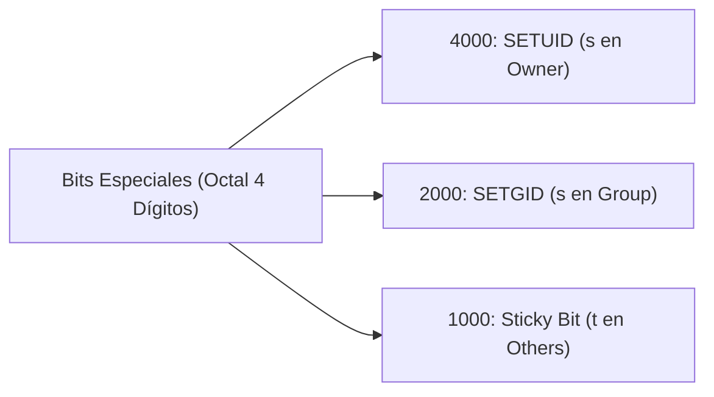
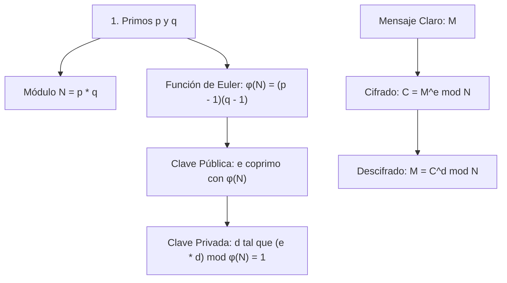

# 🛡️ Cheatsheet: Seguridad, Protección y Permisos en GNU/Linux

> **Cátedra:** Sistemas Operativos II — Ciclo Lectivo 2026  
> **Facultad de Ingeniería — Universidad Nacional de Jujuy (UNJu)**  
> **Equipo Docente:** Ing. María Fernanda Vázquez (Titular) | Ing. Fabio Damián Argañaraz Azua (JTP)

---

## 1. Identificación de Usuarios y Grupos

Linux es un sistema multiusuario donde cada proceso, archivo y recurso pertenece a un **UID** (User ID) y un **GID** (Group ID).

```bash
# Consultar identidad actual, UID, GID y grupos a los que pertenece
id
id -u       # Solo UID numérico (ej. 1000 para primer usuario regular, 0 para root)
id -g       # Solo GID numérico principal
id -un      # Nombre de usuario textual (equivalente a whoami)
id -gn      # Nombre de grupo principal

# Ver quién está conectado al sistema
whoami
w
who
```

### Estructura de `/etc/passwd` (Lectura pública: `644`)
Contiene las cuentas registradas en el sistema. Delimitado por `:` en **7 campos**:
```text
root:x:0:0:root:/root:/bin/bash
 │   │ │ │   │     │      └─ 7. Shell por defecto
 │   │ │ │   │     └──────── 6. Directorio home del usuario
 │   │ │ │   └────────────── 5. Campo de comentario / GECOS (nombre completo)
 │   │ │ └────────────────── 4. GID principal
 │   │ └──────────────────── 3. UID numérico (root siempre es 0)
 │   └────────────────────── 2. Indicador de contraseña ('x' apunta a /etc/shadow)
 └────────────────────────── 1. Nombre de usuario (login)
```

### Estructura de `/etc/shadow` (Lectura restringida: `640` o `000`, solo root/shadow)
Almacena las contraseñas cifradas con algoritmos seguros (SHA-512, yescrypt) y políticas de expiración:
```text
usuario:$6$salt$hash...:19800:0:90:7:::
```

---

## 2. Permisos POSIX Estándar (9 Bits de Protección)

Cada archivo y directorio tiene 3 categorías de usuarios con 3 tipos de derechos:

| Categoría | Símbolo | Significado |
| :--- | :---: | :--- |
| **Usuario / Propietario** | `u` | Usuario dueño del archivo |
| **Grupo** | `g` | Miembros del grupo al que pertenece el archivo |
| **Otros** | `o` | Resto de los usuarios del sistema |
| **Todos** | `a` | Propietario, Grupo y Otros simultáneamente (`ugo`) |

### Valores de Permisos y su Significado según el Tipo de Objeto

| Permiso | Simbólico | Valor Octal | En Archivos Regulares | En Directorios |
| :---: | :---: | :---: | :--- | :--- |
| **Lectura** | `r` | `4` | Leer y visualizar el contenido del archivo | Listar el contenido del directorio (`ls`) |
| **Escritura** | `w` | `2` | Modificar o sobrescribir datos del archivo | Crear, renombrar o eliminar archivos adentro |
| **Ejecución** | `x` | `1` | Ejecutar como programa o script | Atravesar / navegar al directorio (`cd`) |

### Conversión Rápida Simbólico $\leftrightarrow$ Octal

* `rwx` = $4 + 2 + 1 = \mathbf{7}$ (Control total)
* `rw-` = $4 + 2 + 0 = \mathbf{6}$ (Lectura y escritura)
* `r-x` = $4 + 0 + 1 = \mathbf{5}$ (Lectura y ejecución / navegación)
* `r--` = $4 + 0 + 0 = \mathbf{4}$ (Solo lectura)
* `---` = $0 + 0 + 0 = \mathbf{0}$ (Sin acceso alguno)

```bash
# Modificación en modo octal
chmod 755 script.sh       # rwxr-xr-x (dueño total, otros leen/ejecutan)
chmod 644 documento.txt   # rw-r--r-- (dueño lee/escribe, otros solo leen)
chmod 600 clave_privada   # rw------- (solo el dueño lee y escribe)
chmod 700 carpeta_privada # rwx------ (solo el dueño puede entrar y operar)

# Modificación en modo simbólico
chmod u=rwx,g=rx,o= archivo.sh     # Equivale a 750
chmod ugo=r reporte.txt            # Equivale a 444
chmod o-rwx confidencial.txt       # Quita todo acceso al resto
```

---

## 3. Bits Especiales: SETUID, SETGID y Sticky Bit

Además de los 9 bits tradicionales, Linux soporta 3 bits especiales de seguridad en la posición más significativa ($4000, 2000, 1000$):



### Bit SETUID (SUID - Valor Octal `4000`)
* **Propósito:** Al ejecutarse, el proceso adopta temporalmente el **UID Efectivo del propietario** del archivo ejecutable (usualmente `root`), permitiendo a usuarios regulares realizar operaciones privilegiadas de manera controlada.
* **Ejemplo clásico:** `/usr/bin/passwd` tiene permisos `-rwsr-xr-x` (`4755`). Un usuario común lo ejecuta para cambiar su propia clave; el comando corre con UID efectivo 0 para poder escribir en `/etc/shadow`.
* **Identificación:** Se visualiza con una `s` minúscula en el permiso de ejecución del dueño (`rws`). Si no tiene permiso de ejecución base (`rw-`), se muestra con `S` mayúscula.

```bash
# Asignar bit SUID a un binario
sudo chmod 4755 /ruta/al/binario
# o en modo simbólico
sudo chmod u+s /ruta/al/binario

# Buscar todos los binarios con bit SUID en el sistema
find /usr/bin -perm -4000 -type f 2>/dev/null
```

### Bit SETGID (SGID - Valor Octal `2000`)
* **En binarios:** El proceso adopta temporalmente el **GID Efectivo del grupo** del archivo (ej. `/usr/bin/wall`).
* **En directorios:** Todo archivo o subdirectorio creado dentro hereda automáticamente el **GID del directorio padre**, ideal para carpetas de trabajo colaborativo en equipo.

```bash
chmod 2770 /srv/compartido_grupo
# o simbólico
chmod g+s /srv/compartido_grupo
```

### Sticky Bit (Valor Octal `1000`)
* **Propósito:** En directorios compartidos de escritura pública (como `/tmp`), impide que un usuario borre o renombre archivos que pertenezcan a otros usuarios, aun cuando tenga permiso de escritura sobre el directorio.
* **Identificación:** Se visualiza con una `t` minúscula en el permiso de ejecución de otros (`drwxrwxrwt` $\rightarrow$ `1777`).

```bash
chmod 1777 /tmp/compartido
# o simbólico
chmod +t /tmp/compartido
```

---

## 4. Llamadas al Sistema de Seguridad en Linux (POSIX Syscalls)

| Llamada al Sistema | Prototipo C / Descripción | Función en Seguridad |
| :--- | :--- | :--- |
| `chmod(path, mode)` | `int chmod(const char *path, mode_t mode)` | Modifica los permisos de acceso de un archivo/directorio |
| `access(path, mode)` | `int access(const char *path, int mode)` | Comprueba permisos reales del proceso (`R_OK`, `W_OK`, `X_OK`, `F_OK`) |
| `getuid()` | `uid_t getuid(void)` | Retorna el **UID Real** del usuario que inició el proceso |
| `geteuid()` | `uid_t geteuid(void)` | Retorna el **UID Efectivo** utilizado para validar permisos de acceso |
| `getgid()` | `gid_t getgid(void)` | Retorna el **GID Real** del proceso |
| `getegid()` | `gid_t getegid(void)` | Retorna el **GID Efectivo** del proceso |
| `chown(path, u, g)` | `int chown(const char *path, uid_t u, gid_t g)` | Cambia el propietario y grupo de un archivo (solo root) |
| `setuid(uid)` | `int setuid(uid_t uid)` | Modifica el UID del proceso (utilizado tras bifurcar `login`) |
| `setgid(gid)` | `int setgid(gid_t gid)` | Modifica el GID del proceso |

---

## 5. Criptografía y Algoritmo RSA

### Fundamentos Matemáticos (Unidad 4 - Slides 35-36)



### Reglas Clave:
1. $N = p \cdot q$
2. $\phi(N) = (p - 1)(q - 1)$
3. $\gcd(e, \phi(N)) = 1$ y $1 < e < \phi(N)$
4. $e \cdot d \equiv 1 \pmod{\phi(N)}$ (inverso modular multiplicativo)
5. Cifrado con clave pública: $C = M^e \pmod N$
6. Descifrado con clave privada: $M = C^d \pmod N$

---

## 6. Cortafuegos (Firewalls)

* **Política Restrictiva (*Default Deny*):** Se deniega todo el tráfico entrante o saliente por defecto, excepto los puertos y protocolos explícitamente permitidos (máxima seguridad recomendada en producción).
* **Política Permisiva (*Default Allow*):** Se permite todo el tráfico por defecto, salvo aquel que figure explícitamente en listas negras o reglas de denegación.
* **Lo que un Firewall NO puede hacer:**
  * No desinfecta ni elimina malware residente que intenta ingresar.
  * No protege contra tráfico que no atraviese su interfaz (ataques internos o por otros medios).
  * No previene engaños de ingeniería social ni negligencia de usuarios autorizados.
