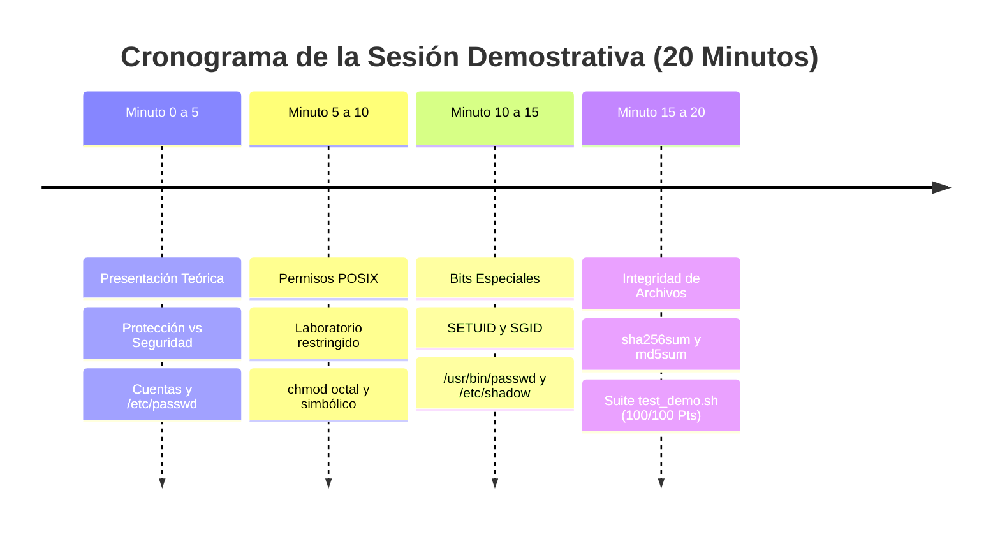

# Trabajo Práctico N° 4 DEMO: Demostración Docente de Seguridad y Protección

> **Universidad Nacional de Jujuy (UNJu)**  
> **Facultad de Ingeniería — Cátedra: Sistemas Operativos II — Ciclo Lectivo 2026**  
> **Equipo Docente:** Ing. María Fernanda Vázquez (Titular) | Ing. Fabio Damián Argañaraz Azua (JTP)  
> **Propósito:** Repositorio Oficial Docente para la sesión de Live-Coding y Proyección en Pantalla (20 minutos)

---

## ⏱️ Guion Docente de Live-Coding (Paso a Paso - 20 Minutos)

Este guion metodológico está diseñado para que el equipo docente proyecte y resuelva en vivo los ejercicios demostrativos, explicando los fundamentos antes de que los estudiantes comiencen su adaptación en `TP04`.



### Bloque 1: Cuentas del Sistema e Identidades (Minutos 0 a 5)
1. **Conceptos Teóricos:** Explicar la diferencia entre Protección (mecanismo interno del kernel) y Seguridad (entorno externo y uso previsto).
2. **Consola en Vivo:**
   ```bash
   cat /etc/passwd | head -n 5
   id
   id -u; id -g; whoami
   ```
3. **Puntos Clave a Destacar:**
   - La estructura de los 7 campos de `/etc/passwd`.
   - ¿Por qué la contraseña figura como `x`? Explicar la separación histórica hacia `/etc/shadow` para proteger los hashes criptográficos ante usuarios no administradores.
   - Shells interactivas (`/bin/bash`) vs shells deshabilitadas (`/usr/sbin/nologin`).

### Bloque 2: Permisos POSIX y Navegación de Directorios (Minutos 5 a 10)
1. **Conceptos Teóricos:** Los 9 bits de protección (`rwx` para Usuario, Grupo y Otros).
2. **Consola en Vivo:**
   ```bash
   mkdir -p soluciones_demo/lab_permisos_demo/restringido
   chmod 700 soluciones_demo/lab_permisos_demo/restringido
   echo "CLAVE_PRIVADA" > soluciones_demo/lab_permisos_demo/restringido/claves_backup.txt
   chmod 600 soluciones_demo/lab_permisos_demo/restringido/claves_backup.txt
   stat -c "%a | %A | %n" soluciones_demo/lab_permisos_demo/restringido/claves_backup.txt
   ```
3. **Puntos Clave a Destacar:**
   - Significado de la `x` en directorios: sin permiso `x`, ningún usuario puede hacer `cd` ni acceder a los inodos internos, incluso si tiene permiso de lectura `r`.
   - Modos octales (`700`, `600`, `770`, `660`) vs modos simbólicos (`u=rwx,g=,o=`).

### Bloque 3: Auditoría de Binarios Privilegiados y SETUID (Minutos 10 a 15)
1. **Conceptos Teóricos:** ¿Cómo puede un usuario normal modificar su contraseña si `/etc/shadow` solo puede ser editado por `root`?
2. **Consola en Vivo:**
   ```bash
   ls -l /usr/bin/passwd
   stat -c "%a | %A | %U | %n" /usr/bin/passwd
   ```
3. **Puntos Clave a Destacar:**
   - Observar la letra `s` minúscula en el permiso de ejecución del propietario (`-rwsr-xr-x` / `4755`).
   - Diferencia fundamental entre **UID Real** (quien ejecutó) y **UID Efectivo** (con qué privilegios valida el kernel las syscalls).
   - Localización con `find`:
     ```bash
     find /usr/bin -perm -4000 -type f 2>/dev/null | head -n 5
     ```

### Bloque 4: Integridad de Archivos con Hashes y Suite de Pruebas (Minutos 15 a 20)
1. **Conceptos Teóricos:** Funciones resumen unidireccionales (One-Way), efecto avalancha, detección de modificaciones no autorizadas y salting en `/etc/shadow`.
2. **Consola en Vivo:**
   - Generación de firma SHA-256 y MD5:
     ```bash
     echo "SISTEMAS OPERATIVOS II - UNJu - 2026" > documento.txt
     sha256sum documento.txt > documento.sha256
     md5sum documento.txt
     ```
   - Verificación automatizada:
     ```bash
     sha256sum -c documento.sha256
     ```
   - Detección de alteración por intrusión:
     ```bash
     echo "ALTERACION_NO_AUTORIZADA" >> documento.txt
     sha256sum -c documento.sha256  # [FALLA / ALERTA DE SEGURIDAD]
     ```
3. **Ejecución Final del Autograder Docente:**
   ```bash
   ./test_demo.sh
   ```
   Mostrar a la clase el reporte en verde con **100 / 100 Puntos** y explicar que en su propio repositorio `TP04`, comenzarán con 0/100 Pts y deberán implementar las soluciones correspondientes.

---

## 📊 Matriz Comparativa: Demostración Docente vs. Trabajo del Alumno

| Ejercicio | Demostración en Clase (`TP04-demo`) | Consigna para el Alumno (`TP04`) |
| :---: | :--- | :--- |
| **Ej. 1** | Auditoría de cuentas de servicio del sistema y cuentas sin shell. | Inspección de `root`, usuario actual, conteo de shells y estructura de `/etc/passwd`. |
| **Ej. 2** | Estructura restrictiva (`700`, `600`) y colaborativa (`770`, `660`). | Estructura confidencial (`750`, `640`) y pública (`755`, `444`). |
| **Ej. 3** | Análisis de bits SETUID y SETGID en binarios de administración. | Análisis de `/usr/bin/passwd`, UID Real vs Efectivo y búsqueda de binarios SUID. |
| **Ej. 4** | Integridad con `sha256sum`/`md5sum`, `sha256sum -c` y detección de adulteración. | Generación de `documento_oficial.sha256`, verificación con `sha256sum -c` y fundamento de salting. |
| **Ej. 5** | Módulo Web Docente evaluado con `autograder_tp4_demo.py`. | Módulo Web Alumno evaluado con `autograder_tp4.py` (hashes SHA-256 protegidos). |

---

## 🛠️ Comprobación Rápida de la Suite Docente

```bash
chmod +x test_demo.sh demo_ejercicios.sh
./test_demo.sh
```
El script generará automáticamente los archivos de prueba en `soluciones_demo/` y validará el 100% de la calificación.
