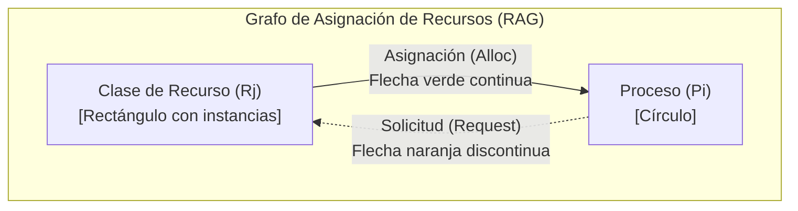
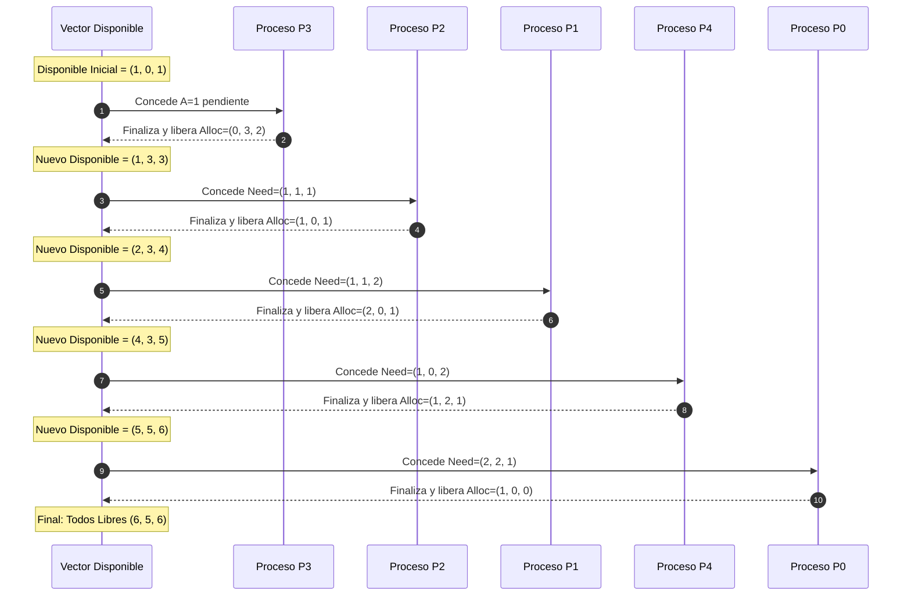

# Guía de Cátedra: Explicación Didáctica de los Laboratorios Interactivos (TP4)
## Teoría de Sistemas Operativos (TSO) — UNJu Facultad de Ingeniería
**Ciclo Lectivo 2026**  
**Responsable de Cátedra:** Ing. María Fernanda Vázquez  
**Jefe de Trabajos Prácticos:** Ing. Fabio D. Argañaraz  
**Documento para:** Uso exclusivo del equipo docente (Clases Teórico-Prácticas, Demostraciones en Vivo y Consultas)

---

## 🎯 Propósito de este Documento

Este material detalla la fundamentación teórica, el comportamiento paso a paso y la dinámica pedagógica de los dos laboratorios visuales embebidos en el **Trabajo Práctico N° 4**:
1. **Laboratorio 1: RAG Studio** (Lienzo SVG de Grafos de Asignación de Recursos).
2. **Laboratorio 2: Banco de Dijkstra** (Simulador Interactivo del Algoritmo del Banquero).

Su objetivo es servir como libreto y guía metodológica para que el equipo docente pueda proyectar la aplicación, formular preguntas disparadoras a los estudiantes y explicar la matemática subyacente de cada transición.

---

# PARTE I: LABORATORIO VISUAL 1 — RAG STUDIO

El **RAG Studio** permite estudiar la detección de interbloqueos y la reducción gráfica formal según el modelo de *Holt (1972)* y *Silberschatz (Cap. 7.2 / 7.6)*.



---

## CASO 1: Preset Silberschatz (Instantánea Inicial Segura y Acíclica)

### 1. Contexto Académico
Este preset corresponde al estado del **Ejercicio 5 del TP (y Ej. 3.a de la guía oficial)**. Modela un sistema multi-instancia con:
- **Procesos:** $P_0, P_1, P_2, P_3, P_4$.
- **Recursos Totales:** $A = 10, B = 5, C = 7$ instancias.

### 2. Topología en el Lienzo
- **Aristas presentes:** Únicamente aristas de **Asignación** ($R_j \to P_i$, verdes continuas con etiquetas de instancias):
  - $A \to P_1$ (2 inst), $A \to P_2$ (3 inst), $A \to P_3$ (2 inst) $\implies \sum Alloc(A) = 7$.
  - $B \to P_0$ (1 inst), $B \to P_3$ (1 inst) $\implies \sum Alloc(B) = 2$.
  - $C \to P_2$ (2 inst), $C \to P_3$ (1 inst), $C \to P_4$ (2 inst) $\implies \sum Alloc(C) = 5$.

### 3. Pregunta Típica del Alumno
> *"Profesor, ¿por qué este grafo inicial es acíclico si hay varios procesos compitiendo por recursos?"*

### 4. Explicación Docente Paso a Paso
1. **Sentido único de las aristas:** En este instante capturado, el sistema solo está mostrando los recursos que los procesos *ya tienen asignados y retenidos*. Todas las flechas nacen en rectángulos ($R$) y terminan en círculos ($P$).
2. **Definición de Ciclo Dirigido:** Para que exista un ciclo, una flecha debe ir de $P \to R$ (solicitud) y otra de $R \to P$ (asignación). Al no haber solicitudes pendientes dibujadas en esta instantánea base, **es topológicamente imposible formar un ciclo**.
3. **Cálculo del Vector Disponible:**
   $$Disponible = Recursos\_Totales - \sum Asignaciones$$
   - $Disponible(A) = 10 - 7 = \mathbf{3}$
   - $Disponible(B) = 5 - 2 = \mathbf{3}$
   - $Disponible(C) = 7 - 5 = \mathbf{2}$
   $$\mathbf{Disponible = (3, 3, 2)}$$
4. **Conclusión Teórica:** Según el **Teorema de Holt/Silberschatz**:  
   $$\text{Sin Ciclos} \implies \text{\textbf{NO hay Interbloqueo (Sistema Seguro y Sano)}}$$

---

## CASO 2: Preset Ciclo (Deadlock Crítico en Monoinstancia)

### 1. Contexto Académico
Modela el escenario teórico clásico de la **Espera Circular de Coffman (Condición 4)** con recursos de una única instancia ($R_1$ y $R_2$).

### 2. Topología en el Lienzo
- $R_1 \to P_1$ *(Asignación: $P_1$ retiene $R_1$)*.
- $P_1 \to R_2$ *(Solicitud: $P_1$ espera $R_2$)*.
- $R_2 \to P_2$ *(Asignación: $P_2$ retiene $R_2$)*.
- $P_2 \to R_1$ *(Solicitud: $P_2$ espera $R_1$)*.

### 3. Dinámica en Vivo con los Alumnos
1. **Presionar `🔍 Detectar Ciclos`:**
   - El lienzo ilumina inmediatamente las 4 aristas en **rojo brillante pulsante**.
   - Se evidencia la cadena cerrada:
     $$P_1 \to R_2 \to P_2 \to R_1 \to P_1$$
2. **Presionar `⚡ Reducir Grafo (Paso a Paso)`:**
   - El sistema emite la alerta: `Grafo Irreducible: Deadlock`.
   - **Explicación al alumno:** Ninguno de los dos procesos puede recibir lo que pide porque el recurso que solicita está en manos exclusivas del otro. Ninguno puede liberar lo que tiene hasta que termine $\implies$ **Interbloqueo Permanente**.
3. **Lección Clave:** En recursos **monoinstancia**, la existencia de un ciclo es **condición necesaria y suficiente** para la existencia de *Deadlock*.

---

## CASO 3: Preset Ejercicio 2 (Reducción Práctica de Grafos de la Cátedra)

### 1. Contexto Académico
Este preset reproduce fielmente el **Ejercicio 2 de la guía práctica histórica (`SO_TP  Nº 4 -2026.pdf`, pág. 2)** y el **Ejercicio 4 del TP4 actual**.

- **Vector Disponible Inicial:** $A=1, B=0, C=1$
- **Matriz de Asignación ($Alloc$):**
  - $P_0 = (1, 0, 0)$
  - $P_1 = (2, 0, 1)$
  - $P_2 = (1, 0, 1)$
  - $P_3 = (0, 3, 2)$
  - $P_4 = (1, 2, 1)$
- **Matriz de Demanda Máxima ($Max$):**
  - $P_0 = (3, 2, 1) \implies Need = (2, 2, 1)$
  - $P_1 = (3, 1, 3) \implies Need = (1, 1, 2)$
  - $P_2 = (2, 1, 2) \implies Need = (1, 1, 1)$
  - $P_3 = (1, 3, 2) \implies Need = (\mathbf{1, 0, 0})$
  - $P_4 = (2, 2, 3) \implies Need = (1, 0, 2)$

### 2. La Gran Duda de los Alumnos
> *"¿Cómo es posible que P3 finalice en el primer paso si tiene una flecha naranja solicitando el recurso A?"*

### 3. Explicación Docente del Teorema de Reducción
Un proceso en un grafo **puede ejecutarse y finalizar** si todas sus solicitudes pendientes pueden ser satisfechas con lo que está libre en ese momento:
$$\text{Solicitud}(P_i) \le \text{Disponible}$$

Comparación proceso por proceso en el estado inicial con $\mathbf{Disponible = (1, 0, 1)}$:

| Proceso | Necesidad / Solicitud | ¿$\le Disponible (1, 0, 1)$? | Diagnóstico |
| :---: | :---: | :---: | :--- |
| **$P_0$** | $(2, 2, 1)$ | **NO** (Falta $A$ y falta $B$) | Bloqueado esperando $B$. |
| **$P_1$** | $(1, 1, 2)$ | **NO** (Falta $B$ y falta $C$) | Bloqueado esperando $B$. |
| **$P_2$** | $(1, 1, 1)$ | **NO** (Falta $B$) | Bloqueado esperando $B$. |
| **$P_3$** | $\mathbf{(1, 0, 0)}$ | **SÍ** ($1 \le 1, 0 \le 0, 0 \le 1$) | **¡PUEDE FINALIZAR!** |
| **$P_4$** | $(1, 0, 2)$ | **NO** (Falta $C$) | Bloqueado esperando $C$. |

> [!IMPORTANT]
> $P_3$ tiene una flecha de solicitud hacia $A$ ($P_3 \to A$), pero como **hay exactamente 1 instancia de $A$ libre**, el Sistema Operativo se la otorga de inmediato. $P_3$ no sufre espera y concluye su ejecución.

---

### 4. Secuencia Paso a Paso de la Reducción (Demostración con el botón `⚡ Reducir Grafo`)



1. **Clic 1 — Finaliza $P_3$:**
   - Desaparecen $P_3$ y sus aristas.
   - Recursos liberados: $Alloc(P_3) = (0, 3, 2)$.
   - $\text{Disponible}' = (1, 0, 1) + (0, 3, 2) = \mathbf{(1, 3, 3)}$.
   - *Enseñanza:* Al liberarse las 3 instancias de $B$, se rompe el cuello de botella que bloqueaba a los demás procesos.
2. **Clic 2 — Finaliza $P_2$:**
   - Ahora $P_2$ compara su $Need=(1, 1, 1) \le (1, 3, 3)$ $\to$ **Verdadero**.
   - Recursos liberados: $Alloc(P_2) = (1, 0, 1)$.
   - $\text{Disponible}'' = (1, 3, 3) + (1, 0, 1) = \mathbf{(2, 3, 4)}$.
3. **Clic 3 — Finaliza $P_1$:**
   - $Need(P_1) = (1, 1, 2) \le (2, 3, 4)$ $\to$ **Verdadero**.
   - Libera $Alloc(P_1) = (2, 0, 1)$.
   - $\text{Disponible}''' = (2, 3, 4) + (2, 0, 1) = \mathbf{(4, 3, 5)}$.
4. **Clic 4 — Finaliza $P_4$:**
   - $Need(P_4) = (1, 0, 2) \le (4, 3, 5)$ $\to$ **Verdadero**.
   - Libera $Alloc(P_4) = (1, 2, 1)$.
   - $\text{Disponible}'''' = (4, 3, 5) + (1, 2, 1) = \mathbf{(5, 5, 6)}$.
5. **Clic 5 — Finaliza $P_0$:**
   - Libera $Alloc(P_0) = (1, 0, 0)$.
   - $\text{Disponible final} = \mathbf{(6, 5, 6)}$ *(la totalidad de los recursos físicos del sistema)*.
6. **Diagnóstico Final de la Cátedra:**
   - ¿Queda el grafo completamente reducido? **SÍ**.
   - ¿Existe interbloqueo? **NO**.
   - Secuencia de reducción válida: $\mathbf{\langle P_3, P_2, P_1, P_4, P_0 \rangle}$.

---

# PARTE II: LABORATORIO VISUAL 2 — BANCO DE DIJKSTRA

Este laboratorio permite simular el **Algoritmo del Banquero** *(Dijkstra, 1965; Silberschatz Cap. 7.5)* con soporte para ejecución manual paso a paso, auto-ejecución con control de velocidad y pruebas dinámicas de solicitud de recursos.

---

## CASO 1: Escenario Ejercicio 1 (Práctica Oficial con 4 Recursos A, B, C, D)

### 1. Estado Inicial del Sistema
- **Recursos:** $A, B, C, D$.
- **Vector Disponible inicial ($Work$):** $(2, 3, 1, 1)$.
- **Matriz de Asignación ($Alloc$):**
  - $P_0 = (0, 0, 1, 2)$
  - $P_1 = (1, 0, 0, 1)$
  - $P_2 = (1, 3, 3, 0)$
  - $P_3 = (0, 2, 1, 2)$
  - $P_4 = (1, 0, 1, 2)$
- **Matriz Demanda Máxima ($Max$):**
  - $P_0 = (0, 3, 1, 2)$
  - $P_1 = (1, 3, 2, 2)$
  - $P_2 = (2, 3, 4, 2)$
  - $P_3 = (0, 4, 5, 2)$
  - $P_4 = (1, 1, 5, 3)$
- **Matriz Necesidad ($Need = Max - Alloc$):**
  - $P_0 = (0, 3, 0, 0)$
  - $P_1 = (0, 3, 2, 1)$
  - $P_2 = (1, 0, 1, 2)$
  - $P_3 = (0, 2, 4, 0)$
  - $P_4 = (0, 1, 4, 1)$

---

### 2. Guía para Conducir la Demostración Manual con `⏭ Paso a Paso`

El docente debe pedir a los alumnos que observen la fila de **Available** $(2, 3, 1, 1)$ y la comparen contra las filas de la matriz **Need**:

#### Clic 1 — Inicialización y Evaluación de $P_0$:
- **Evaluación:** ¿$Need(P_0) = (0, 3, 0, 0) \le Work = (2, 3, 1, 1)$?
  - $A: 0 \le 2$ (Cumple)
  - $B: 3 \le 3$ (Cumple)
  - $C: 0 \le 1$ (Cumple)
  - $D: 0 \le 1$ (Cumple)
  - $\implies$ **$P_0$ puede ejecutar**.
- **Acción del Simulador:**
  - La fila de $P_0$ se resalta en verde con la píldora `✓ Paso 1`.
  - Se suman los recursos retenidos por $P_0$:
    $$Work = (2, 3, 1, 1) + Alloc(P_0)(0, 0, 1, 2) = \mathbf{(2, 3, 2, 3)}$$
  - Las celdas de Available destellan en cian actualizándose a $(2, 3, 2, 3)$.

#### Clic 2 — Evaluación de $P_2$:
- Con $Work = (2, 3, 2, 3)$:
  - ¿$Need(P_1) = (0, 3, 2, 1) \le (2, 3, 2, 3)$? Cumple.
  - ¿$Need(P_2) = (1, 0, 1, 2) \le (2, 3, 2, 3)$? Cumple ($1 \le 2, 0 \le 3, 1 \le 2, 2 \le 3$).
  - El algoritmo despacha al siguiente candidato válido ($P_2$ o $P_1$). Supongamos $P_2$:
  - Fila $P_2$ en verde: `✓ Paso 2`.
  - Libera $Alloc(P_2) = (1, 3, 3, 0)$:
    $$Work = (2, 3, 2, 3) + (1, 3, 3, 0) = \mathbf{(3, 6, 5, 3)}$$

#### Clic 3 — Evaluación de $P_1$:
- Con $Work = (3, 6, 5, 3)$:
  - $Need(P_1) = (0, 3, 2, 1) \le (3, 6, 5, 3) \implies$ **Verdadero**.
  - Fila $P_1$ en verde: `✓ Paso 3`.
  - Libera $Alloc(P_1) = (1, 0, 0, 1)$:
    $$Work = (3, 6, 5, 3) + (1, 0, 0, 1) = \mathbf{(4, 6, 5, 4)}$$

#### Clic 4 — Evaluación de $P_3$:
- Con $Work = (4, 6, 5, 4)$:
  - $Need(P_3) = (0, 2, 4, 0) \le (4, 6, 5, 4) \implies$ **Verdadero**.
  - Fila $P_3$ en verde: `✓ Paso 4`.
  - Libera $Alloc(P_3) = (0, 2, 1, 2)$:
    $$Work = (4, 6, 5, 4) + (0, 2, 1, 2) = \mathbf{(4, 8, 6, 6)}$$

#### Clic 5 — Evaluación de $P_4$:
- Con $Work = (4, 8, 6, 6)$:
  - $Need(P_4) = (0, 1, 4, 1) \le (4, 8, 6, 6) \implies$ **Verdadero**.
  - Fila $P_4$ en verde: `✓ Paso 5`.
  - Libera $Alloc(P_4) = (1, 0, 1, 2)$:
    $$Work = (4, 8, 6, 6) + (1, 0, 1, 2) = \mathbf{(5, 8, 7, 8)}$$
- **Resultado en el Simulador:**
  - Badge superior: `✅ Estado Seguro: < P0, P2, P1, P3, P4 >`.
  - Botón: `✓ Secuencia Completa`.

> [!TIP]
> **Pregunta para el examen / clase:** *¿Es esta la única secuencia segura posible?*  
> **Respuesta:** No. Por ejemplo, en el paso 2 se pudo despachar a $P_1$ antes que a $P_2$. La condición del algoritmo es que exista **al menos una secuencia segura** para certificar que el sistema está libre de interbloqueos.

---

## CASO 2: Test de Solicitud Dinámica de $P_1(0, 3, 0, 0)$

### 1. Contexto Académico
Corresponde al **Ejercicio 1.e de la guía oficial** y al **Ejercicio 3 del TP4**. Simula la llegada en tiempo real de una petición de recursos por parte de un proceso en ejecución.

### 2. Demostración en Vivo con el Botón `🧪 Test Solicitud Dinámica`
El docente activa el botón. La simulación ejecuta y detiene la pantalla en cada verificación:

```
[SOLICITUD DINÁMICA DE P1 = (0, 3, 0, 0)]
```

#### Paso 1: Prueba de Legalidad ($Request \le Need$)
- $P_1$ pide $(0, 3, 0, 0)$. Su necesidad declarada es $Need(P_1) = (0, 3, 2, 1)$.
- ¿$0 \le 0, 3 \le 3, 0 \le 2, 0 \le 1$? **SÍ**.
- *Conclusión:* La petición es legal; el proceso no excede su demanda máxima declarada.

#### Paso 2: Prueba de Disponibilidad ($Request \le Available$)
- El sistema tiene $Available = (2, 3, 1, 1)$.
- ¿$(0, 3, 0, 0) \le (2, 3, 1, 1)$? **SÍ**.
- *Conclusión:* Hay recursos físicos libres en el inventario para satisfacerla.

#### Paso 3: Asignación Provisional Simulada en las Matrices
El simulador altera las tablas del DOM en tiempo real:
- $Available' = Available - Request = (2, 3, 1, 1) - (0, 3, 0, 0) = \mathbf{(2, 0, 1, 1)}$
  - **Efecto visual:** La celda del **Recurso B pasa a 0 y parpadea en rojo peligroso**.
- $Alloc(P_1)' = Alloc(P_1) + Request = (1, 0, 0, 1) + (0, 3, 0, 0) = \mathbf{(1, 3, 0, 1)}$
- $Need(P_1)' = Need(P_1) - Request = (0, 3, 2, 1) - (0, 3, 0, 0) = \mathbf{(0, 0, 2, 1)}$

#### Paso 4: Evaluación de Seguridad sobre el Estado Simulado
Ahora el Sistema Operativo evalúa si con el nuevo disponible $(2, \mathbf{0}, 1, 1)$ existe alguna secuencia segura:
- ¿Puede ejecutar $P_0$? $Need(P_0) = (0, \mathbf{3}, 0, 0)$ $\to$ Requiere $B=3$, pero hay **$B=0$**. **BLOQUEADO**.
- ¿Puede ejecutar $P_1$? $Need(P_1)' = (0, 0, \mathbf{2}, 1)$ $\to$ Requiere $C=2$, pero hay **$C=1$**. **BLOQUEADO**.
- ¿Puede ejecutar $P_2$? $Need(P_2) = (1, 0, 1, \mathbf{2})$ $\to$ Requiere $D=2$, pero hay **$D=1$**. **BLOQUEADO**.
- ¿Puede ejecutar $P_3$? $Need(P_3) = (0, \mathbf{2}, 4, 0)$ $\to$ Requiere $B=2$, pero hay **$B=0$**. **BLOQUEADO**.
- ¿Puede ejecutar $P_4$? $Need(P_4) = (0, \mathbf{1}, 4, 1)$ $\to$ Requiere $B=1$, pero hay **$B=0$**. **BLOQUEADO**.

#### Paso 5: Reacción Visual y Dictamen del SO
- **Efecto en el simulador:** **Todas las filas de la tabla se tiñen de rojo (`.blocked-row`)** con etiquetas `⛔ Bloqueado`.
- **Badge:** `⚠️ ESTADO INSEGURO — Solicitud Suspendida`.
- **Dictamen de Cátedra:**
  > *"Aunque la solicitud era válida y había recursos libres, concederla consume todas las instancias del recurso B, dejando al sistema en un **Estado Inseguro** (sin garantía de que algún proceso pueda terminar). Por lo tanto, **el Sistema Operativo DENIEGA la concesión inmediata y pone a $P_1$ en cola de espera (estado Bloqueado)** hasta que otros procesos liberen recursos."*

---

## CASO 3: Escenario Silberschatz (3 Recursos A, B, C)

Al presionar `Cargar Escenario Silberschatz (A,B,C)`, el cockpit carga el ejemplo del libro de texto:
- $Available = (3, 3, 2)$.
- $Alloc = [P_0:(0,1,0), P_1:(2,0,0), P_2:(3,0,2), P_3:(2,1,1), P_4:(0,0,2)]$.
- $Max = [P_0:(7,5,3), P_1:(3,2,2), P_2:(9,0,2), P_3:(2,2,2), P_4:(4,3,3)]$.

### Comportamiento Didáctico
1. **Auto-Ejecutar:** Muestra la secuencia canónica del libro:
   $$\mathbf{\langle P_1, P_3, P_4, P_0, P_2 \rangle}$$
2. **Test Solicitud Dinámica en Silberschatz ($P_1$ solicita $1, 0, 2$):**
   - A diferencia del Ejercicio 1 (que era denegada), en Silberschatz la concesión deja $Available' = (2, 3, 0)$.
   - Como $Need(P_1)' = (0, 2, 0) \le (2, 3, 0)$, $P_1$ puede terminar primero, liberar sus recursos y permitir que todos los demás concluyan.
   - **Badge:** `✓ Solicitud Concedida (Seguro)`.
   - **Utilidad Docente:** Permite contrastar en segundos una solicitud que **debe ser rechazada/postergada** (Ej. 1) frente a una que **sí puede ser concedida de forma segura** (Silberschatz).

---

# PARTE III: RESUMEN METODOLÓGICO PARA EL DOCENTE

| Situación en Clase | Herramienta a Usar | Acción Sugerida |
| :--- | :--- | :--- |
| **Explicar qué es un RAG** | *RAG Studio* $\to$ `Preset Silberschatz` | Mostrar rectángulos, círculos y el cálculo de Available inicial $10-7=3$. |
| **Explicar Espera Circular** | *RAG Studio* $\to$ `Preset Ciclo (Deadlock)` | Pulsar `Detectar Ciclos` para mostrar el bucle rojo $P_1 \to R_2 \to P_2 \to R_1 \to P_1$. |
| **Explicar Reducción de Grafos** | *RAG Studio* $\to$ `Preset Ejercicio 2` | Demostrar por qué $P_3$ arranca primero ($Need \le Disp$) y pulsar `Reducir Grafo` paso a paso. |
| **Explicar Banquero (Seguro)** | *Banquero* $\to$ `Escenario Ejercicio 1` | Usar `⏭ Paso a Paso` dejando que los alumnos calculen $Work = Work + Alloc$ antes de hacer clic. |
| **Explicar Estado Inseguro** | *Banquero* $\to$ `🧪 Test Solicitud Dinámica` | Mostrar cómo al quedar $B=0$, todos los procesos se bloquean y el SO debe suspender a $P_1$. |

---

*Cátedra de Teoría de Sistemas Operativos — Facultad de Ingeniería, Universidad Nacional de Jujuy (2026)*
